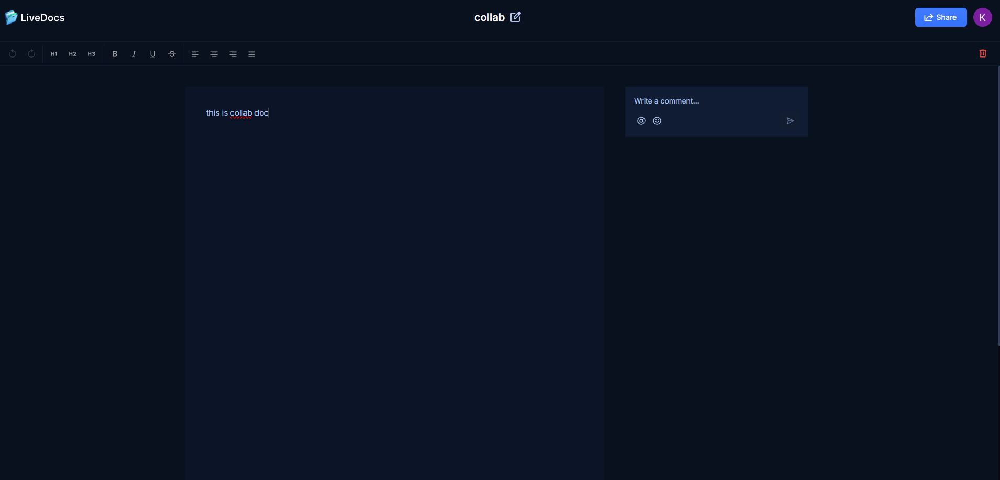

## Table of contents

- [General info](#general-info)
- [Technologies](#technologies)
- [Features](#features)
- [Setup](#setup)
- [Demo](#demo)

## General info

Built with Next.js, Liveblocks for real-time features, DoCollabs is a realtime document editor.

## Technologies

- Next.js
- TypeScript
- Liveblocks
- Lexical Editor
- ShadCN
- Tailwind CSS

## Features

- Authentication: User management through Clerk, ensuring secure and efficient authentication.
- Collaborative Text Editor: Multiple users can edit the same document simultaneously with real-time updates.
- Documents Management:
  - Create Documents: Users can create new documents.
  - Delete Documents: Users can delete documents they own.
  - Share Documents: Users can share documents via email or link with view/edit permissions.
  - List Documents: Display all documents owned or shared with the user.
- Comments: Users can add inline and general comments, with threading for discussions.
- Active Collaborators on Text Editor: Show active collaborators with real-time presence indicators.
- Notifications: Notify users of document shares, new comments, and collaborator activities.

## Setup

To run this project locally:

```
$ npm install
$ npm run dev
```

Open http://localhost:3000 to view client in your browser.

## Demo

Vist [docollabs](https://docollabs.vercel.app/)
